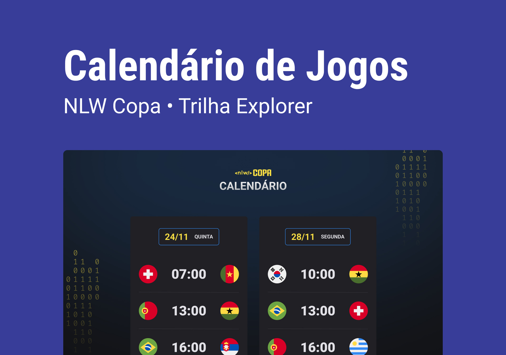

<h1 align="center"> NLW #10 COPA </h1>

Evento exclusivo e gratuito, promovido pela Rocketseat para ensino de tecnologias WEB.

 

  <a href="#-tecnologias">Tecnologias</a>&nbsp;&nbsp;&nbsp;|&nbsp;&nbsp;&nbsp;
  <a href="#-projeto">Projeto</a>&nbsp;&nbsp;&nbsp;|&nbsp;&nbsp;&nbsp;
  <a href="#-layout">Layout</a>&nbsp;&nbsp;&nbsp;

 

  

 

## 🚀 Tecnologias

Esse projeto foi desenvolvido com as seguintes tecnologias:

- HTML e CSS
- JavaScript
- GIT e GitHub

 

## 💻 Projeto

O calendário da Copa é um projeto que mostra os jogos da Copa de 2022.

 

## 📩 Layout

Você pode acessar o layout do projeto através [DESSE LINK](https://www.figma.com/file/J1Z33MISC22YZB8wfxiIns/NLW-Copa-Explorer/duplicate).
